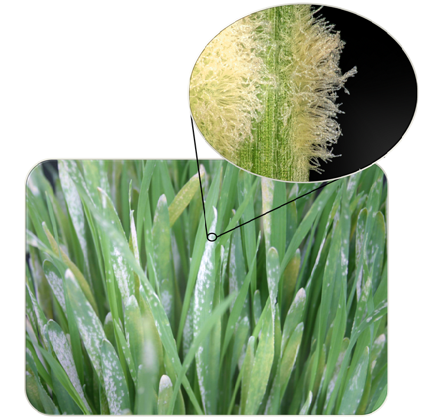
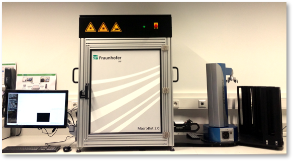
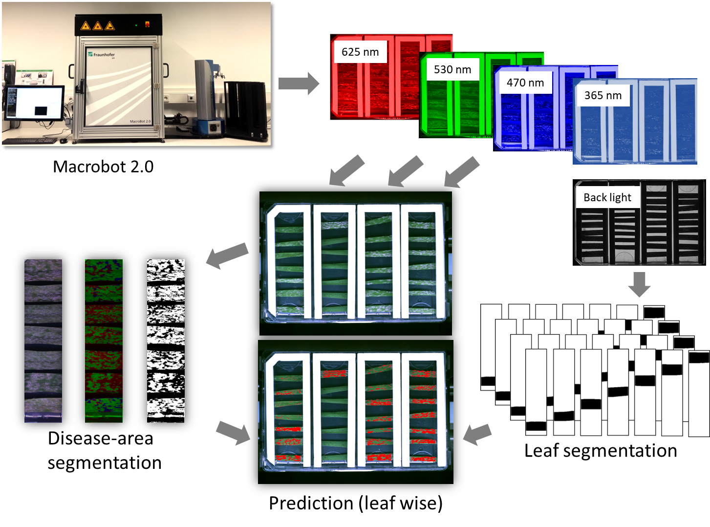

============
Introduction
============

Macrobot Software Overview
==========================
Macrobot is a software and hardware framework for high-throughput image acquisition and analysis of microscopic and macroscopic images in plant pathology.

Deep investigation of the intimate details of the plant-pathogen interactions is essential to truly understand the defense mechanism of the plants and the evading strategies of the pathogens. By using this knowledge in plant breeding we may significantly diminish the enormous disease-related losses in agriculture by simultaneous reduction of application of potentially hazardous pesticides.

Currently the macrobot software can detect and quantify the following plant-pathogen interactions:

- Barley powdery mildew (Blumeria graminis f. sp hordei) on barely leaves
- Wheat powdery mildew (Blumeria graminis f. sp tritici) on wheat leaves (Figure 1)
- Wheat yellow rust (Puccinia graminis f.sp. tritici) on wheat leaves
- Wheat brown rust (Puccinia dispersa f. sp. tritici) on wheat leaves

Figure 1: Powdery mildew on barley plants

Macrobot Image Acquisition
==========================

The hardware system is based on a custom fully automated multispectral 2D imaging station (Figure 2).

Figure 2: Macrobot Module

See the macrobot hardware in action: https://www.youtube.com/watch?v=SmoKQ_uMp34&t=56s

Macrobot Analysis Pipeline
==========================
Our image analysis pipeline (Figure 3) is aimed to detect macroscopic disease symptoms for barley and wheat powdery mildew as well as yellow and brown rust.

Figure 3: Software pipeline

