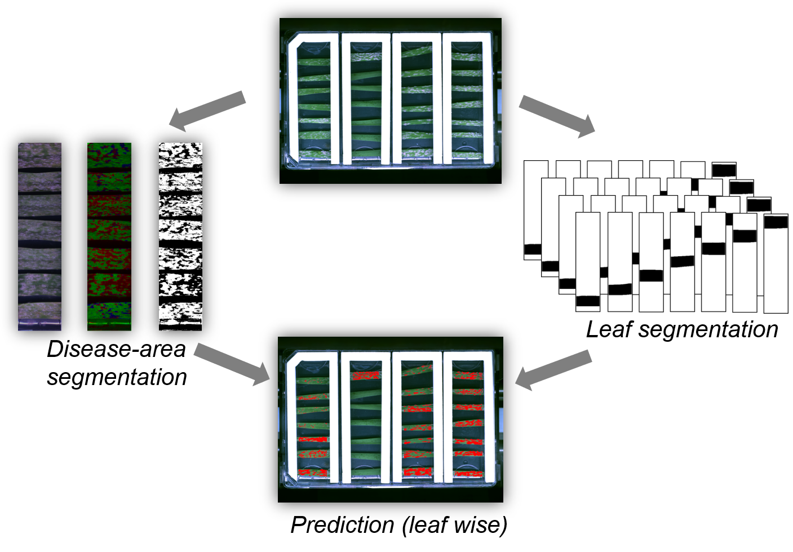

 
# Summary
Crop protection against pathogens is mostly provided by the application of chemical agents (pesticides), however, many of them have detrimental effects on non-target species.  Therefore, the trend is towards reducing the pesticide application and development of alternative and integrated protection methods. Probably the most sustainable method is exploring the natural genetic resources and breeding for disease resistance. The plant breeding is as old as the domestication of the first agricultural plants (>10 000 years). The “Green revolution” [@article] of the 1950-1960 and the more recent “omics” revolution (a combined term that refers to the fields of study in biology ending in -omics, such as genomics, proteomics or metabolomics) [@RN13] introduced many new approaches and technologies but the observation methods of the breeders remained mostly unchanged. Typically, the breeder looks on the appearance (phenotype) of the plant and selects for plants that carry favorable traits, such as higher grain yield or stronger resistance to diseases. Introducing of the so-called molecular markers was a significant improvement to boost dramatically the breeding research. Recently, new high-throughput observation methods for so-called Phenomics [@BILDER200930] were introduced, thus providing the fundament for another breeding revolution. However, phenotyping of the early, and most critical stages of the interactions between plants and pathogens, was significantly withdrawn by the lack of technology for high-throughput phenotyping on a macroscopic and microscopic scale. To contribute to solving this problem, we have developed the BluVision Macro framework aimed to allow strictly quantitative assessment of disease and host responses on a macroscopic level. The system consists of a hardware part – the Macrobot [@Lueck2020.03.16.993451] - a multimodal imaging station and robotized sample magazine/loader, and the BluVision Macro software, described in this article. The system is designed to work with samples placed in standard containers, so-called microtiter plates (MTP), which are well-established standard in biology and medicine. The loading of the MTPs to the imaging station and the image acquisition is fully automated. The system uses a 14-bit monochrome camera (Thorlabs 8050M-GE-TE) at a resolution of 3296×2472 px. The illumination is based on narrow bandwidth isotropic LED light sources (Metaphase Exolight-ISO-14-XXX-U) with 365nm (UV), 470nm (blue), 530nm (green) and 625nm (red) peak wavelength. For each plate monochrome images in all illumination, wavelengths are acquired separately and stored in 16-bit TIFF image files. Additionally, a background illumination image is taken and used for separation of the foreground and background.
The present development is focused on the quantification of some of the most relevant plant leaf diseases – the powdery mildews and the rusts. 

The effect of powdery mildew on crop yields can amount to 40% of harvested grain [@doi:10.1038/sj.bjp.0703793]. Besides being an agriculturally important pathogen, the powdery mildews of wheat and barley are important models for studying the plant-pathogen interactions [@RN14]. Wheat leaf rust and stripe rust rank among the major fungal diseases of worldwide wheat cultivation [@article2]. Frequently appearing epidemics of those rust diseases lead to yield losses up to 70% [@doi:10.1080/07060660509507230] in combination with a decreased grain quality [@book]. 

The image analysis pipeline currently contains modules for powdery mildew of barley and wheat (Blumeria graminis f. sp. hordei resp. tritici), wheat stripe rust (Puccinia striiformis f.sp. tritici), wheat leaf rust (P. triticina), and will work without major modification also for barley leaf and stripe rusts and probably some other leaf disease with a similar appearance. Phenotyping of other disease and non-disease related phenotypes is possible but it will require developments of dedicated modules. The system is running in production mode and generates phenotyping data for powdery mildew and rust disease resistance screens at the Leibniz Institute of Plant Genetics and Crop Plant Research (IPK) in Gatersleben, Germany, and the Julius Kühn-Institute (JKI) in Quedlinburg, Germany.

  
# Conclusions
 Deep investigation of the intimate details of the plant-pathogen interactions is essential to truly understand the defense mechanism of the plants and the evading strategies of the pathogens. By using this knowledge in plant breeding we may significantly diminish the enormous disease-related losses in agriculture by simultaneous reduction of application of potentially hazardous pesticides. We have developed an open source image analysis software called macrobot for studying plant-pathogen interactions on a macroscopic level, which allows an efficient and percise prediction of common powdery mildews and the rusts plant leaf diseases.
 
# Installation
The macrobot software can simply be installed with Ananconda and pip and was build and tested on Wondows operation system.  
It requires Python 3.7 or higher, numpy [@doi:10.1109/MCSE.2011.37], scikit-image [@scikit-image], opencv-python [@opencv_library], pytest and jinja2. 

# Acknowledgment
This work was supported by grants from the German Federal Ministry of Research and Education (BMBF) – DPPN (FKZ 031A05) and Gene Bank 2.0  (FKZ 031B0184)

# References
